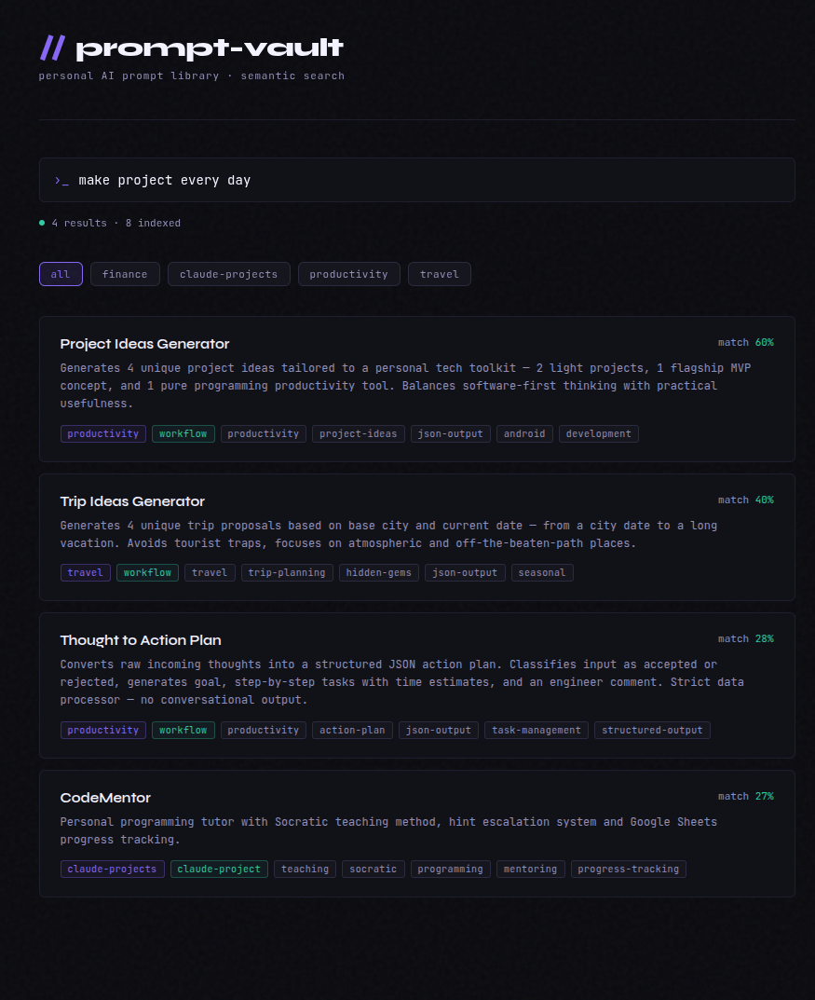

# prompt-vault

Personal AI prompt library with semantic search powered by embeddings.

## Live

🔍 **[jarkendar.github.io/prompt-vault](https://jarkendar.github.io/prompt-vault/)**



## Overview

A self-hosted, fully static prompt library built on top of GitHub infrastructure.
No external backend required — embeddings are generated via GitHub Actions and
search runs entirely in the browser via GitHub Pages.

Prompts are written in English. Search queries can be written in Polish or English
thanks to the multilingual embedding model.

## Project Structure

```
prompt-vault/
├── prompts/
│   ├── education/
│   ├── finance/
│   ├── productivity/
│   ├── travel/
│   └── ...
├── scripts/
│   └── generate_embeddings.py
├── docs/
│   ├── index.html
│   └── preview.png
├── embeddings.json
├── .github/
│   └── workflows/
│       └── generate_embeddings.yml
└── README.md
```

## Prompt File Convention

Each prompt consists of two files:

| File | Purpose |
|---|---|
| `prompt-name.md` | Raw prompt content — clean, ready to copy |
| `prompt-name.json` | Metadata: title, category, tags, use_case, tested_on, additional_data |

### Metadata fields

| Field | Description |
|---|---|
| `title` | Display name |
| `category` | Topic-based folder (e.g. `education`, `travel`) |
| `use_case` | Technical context: `claude-project`, `workflow`, etc. |
| `tags` | Array of short labels |
| `description` | One-sentence summary |
| `language` | Prompt language |
| `response_language` | Expected response language |
| `tested_on` | Model the prompt was tested on |
| `version` | Semantic version |
| `additional_data` | Placeholders to replace before use (e.g. `<city>`, `<current_date>`) |

## Tech Stack

| Component | Technology |
|---|---|
| Embeddings model | `paraphrase-multilingual-MiniLM-L12-v2` (sentence-transformers) |
| Search in browser | Transformers.js (same model, quantized) |
| CI/CD | GitHub Actions |
| Hosting | GitHub Pages |
| Search algorithm | Cosine similarity in vanilla JS |
| Storage | Markdown + JSON files in repository |

## How It Works

1. Prompts are stored as `.md` files with matching `.json` metadata
2. On every push to `prompts/`, GitHub Actions generates `embeddings.json`
3. The search page loads embeddings and the multilingual model in the browser
4. Queries in Polish or English are embedded and compared via cosine similarity

## Build Log

- **Phase 1** – repo structure, prompt file schema, seed data across 4 categories
- **Phase 2** – Python embedding pipeline with sentence-transformers, GitHub Actions auto-regeneration with model caching
- **Phase 3** – static search UI with Transformers.js, GitHub Pages deploy, multilingual search (PL/EN)
- **Phase 4** – category filters, one-click copy, UI contrast and button polish

## License

MIT